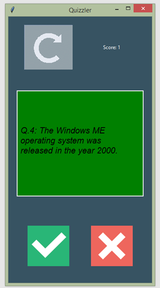

# QuizGameGUI
Python quiz game GUI using Open Trivia API
<li> The quizs in the program are from Trivia API.</li>
<li> The screen will turn green or red to suggest if the answer is right.</li>
<li>The refresh button is active when you finish all 10 questions so you can click it to start again.</li>

